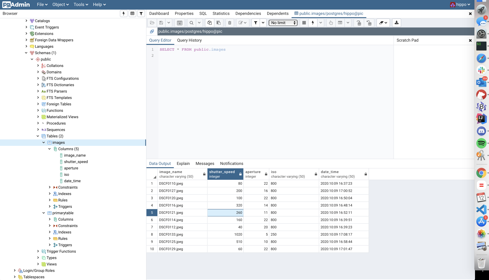

# Picture-in-Picture
A project in Python based off my amateur photography 

## Backstory and Intent

A couple weeks ago I bought an interchangable lens camera and decided to dip my feet into capturing pictures. 

I had no idea the practical effects of changing the ISO, aperture, shutter speed. I decided to create a project in Python that would capture the metadata of my photographs and store it somewhere so I can use it later to see how each setting changes my pictures. 

## Technologies

### Modules

PIL - To capture the metadata

multiprocessing - For IPC between files 

psycopg2 - Manipulating data in my local PGAdmin

### Environments

All data was stored in a pgAdmin Docker container I pulled from Dockerhub

### Screenshots

***Note***

All usernames and passwords are provided as default settings

### Whats Next

* Front-End UI
* Add in image classification using pre existing libraries

